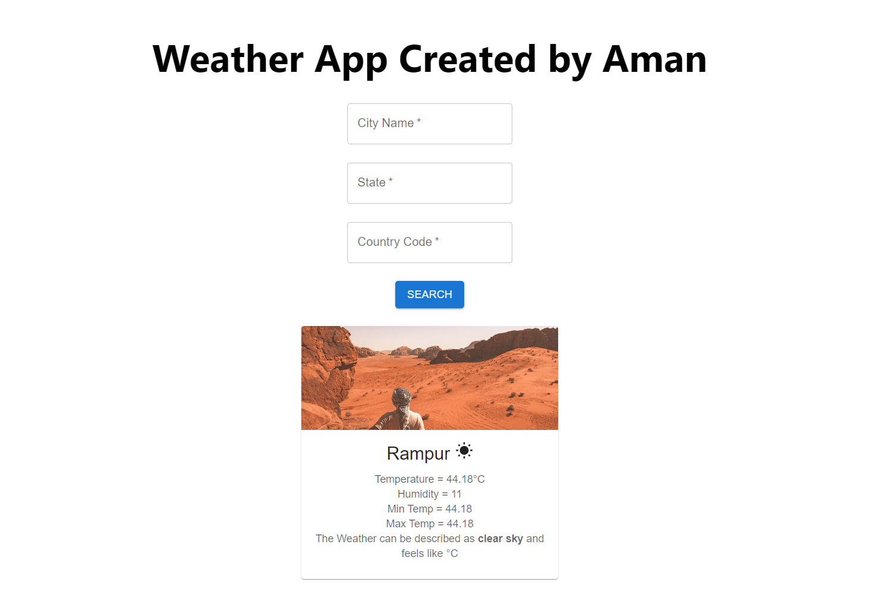

# GoBananas Weather App

GoBananas is a simple React application that fetches data from a public API (OpenWeatherMap) and displays it in a user-friendly format. The application uses Material-UI for styling and provides a search feature to filter and display weather information based on user input.



## Features

- Fetches weather data from the OpenWeatherMap API
- Displays weather information in a clean and user-friendly format
- Includes a search feature to filter weather data based on city, state, and country
- Utilizes Material-UI components for styling and responsiveness

## Project Structure

gobananas-weather-app/
├── node_modules/
├── public/
│ ├── index.html
│ └── ...
├── src/
│ ├── components/
│ │ ├── infobox.jsx
│ │ └── SearchBox.jsx
│ ├── services/
│ │ └── api.jsx
│ ├── pages/
│ │ └── Weatherapp.jsx
│ ├── App.js
│ ├── index.css
│ └── index.js
├── .gitignore
├── package.json
├── README.md
└── yarn.lock


## Installation

To run this project locally, follow these steps:

1. Clone the repository:
   ```bash
   git clone https://github.com/aman8218/Gobananas-weather-app.git

2. Navigate to the project directory:
   ```bash
   cd gobananas-app

3. Install the dependencies:
   ```bash
   npm install

4. Start the development server:
   ```bash
   npm run dev

5. Usage
   ```bash
   1. Enter the city, state, and country code in the search fields.
   2. Click the "Search" button to fetch and display weather information.
   3. The weather information, including temperature, humidity, and description, will be displayed below the search bar.